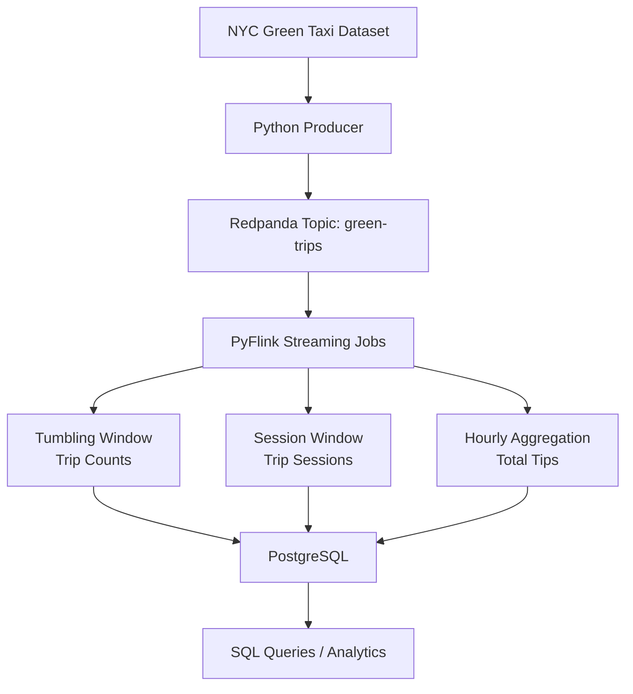

# Streaming with Redpanda and PyFlink

This project implements a **stream processing pipeline** using:

- **Redpanda** (Kafka-compatible streaming platform)
- **PyFlink**
- **PostgreSQL**
- **NYC Green Taxi dataset (October 2025)**

The pipeline streams taxi trip events, processes them using Flink window operations, and stores aggregated results in PostgreSQL.

## Architecture


---

### Question 1. Redpanda version

Run `rpk version` inside the Redpanda container:

```bash
docker exec -it workshop-redpanda-1 rpk version
```
Output:
```
rpk version: v25.3.9
Git ref:     836b4a36ef6d5121edbb1e68f0f673c2a8a244e2
Build date:  2026 Feb 26 07:48:21 Thu
OS/Arch:     linux/amd64
```
Answer: v25.3.9

### Question 2. Sending data to Redpanda

A Python producer was implemented to send the Green Taxi data (October 2025) to the green-trips topic.

File: q2_producer_green.py
Output: 
```
Time required to send all 49,416 records: 16.44 seconds
```

Answer: 10 seconds (closest to the measured time)

### Question 3. Consumer – trip distance

A Kafka consumer reads messages from the green-trips topic and counts trips where: trip_distance > 5.0

File: q3_consumer.py

Output: 
```
Counting trips with trip_distance > 5.0 in topic green-trips...
Processed 5000 records...
...
Total processed: 49416
Number of trips with trip_distance > 5.0 km: 8506
```
Answer: 8506

### Question 4. Tumbling window – pickup location

A PyFlink job using a 5-minute tumbling window counts trips per PULocationID. Results are stored in PostgreSQL.

File: q4_tumbling_window.py

SQL query:
```sql
SELECT PULocationID, num_trips
FROM trip_counts_per_window
ORDER BY num_trips DESC
LIMIT 3;
```
Output:
```sql
 pulocationid | num_trips
--------------+-----------
           74 |        15
           74 |        13
           74 |        13
```           
Answer: 74

### Question 5. Session window – longest streak

A PyFlink session window with a 5-minute gap groups trips by PULocationID.

File: q5_session_window.py

The longest session (maximum number of trips in one session) was found using:

SQL query:
```sql
SELECT PULocationID, num_trips
FROM session_results
ORDER BY num_trips DESC
LIMIT 1;
```
Output:
```
 pulocationid | num_trips
--------------+-----------
           74 |        81
```
Answer: 81

### Question 6. Tumbling window – largest tip

A 1-hour tumbling window calculates the total tip_amount across all locations.

File: q6_hourly_tips.py

SQL query:
```SQL 

SELECT window_start, total_tip_amount
FROM hourly_tips
ORDER BY total_tip_amount DESC
LIMIT 1;
```
Output:
```
 window_start         | total_tip_amount
----------------------+-------------------
2025-10-16 18:00:00   | 510.8599999999999
```
Answer: 2025-10-16 18:00:00
